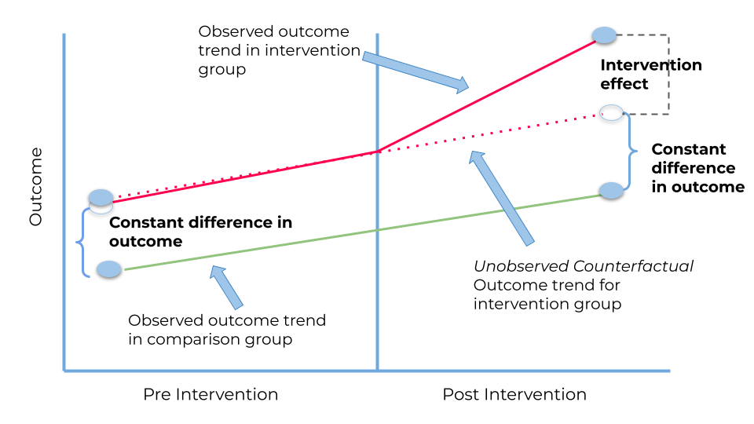
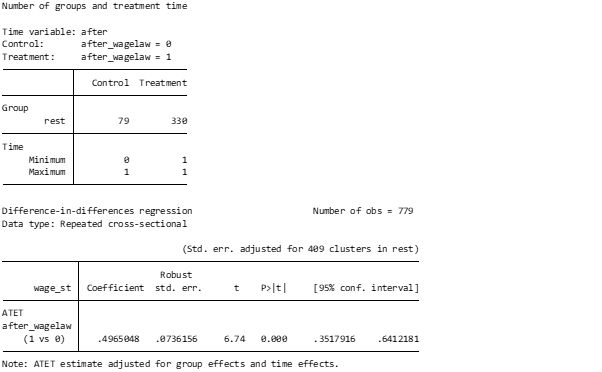
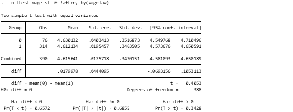
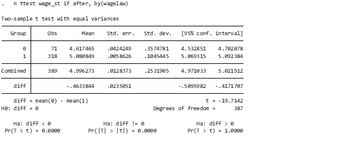
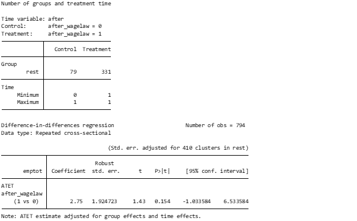
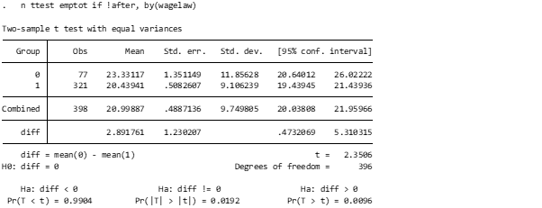
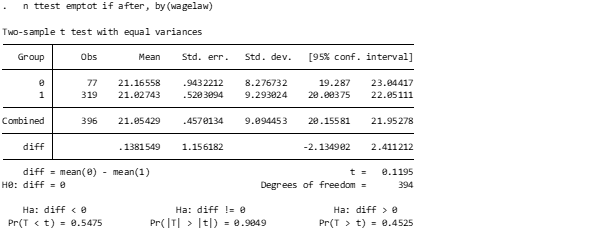
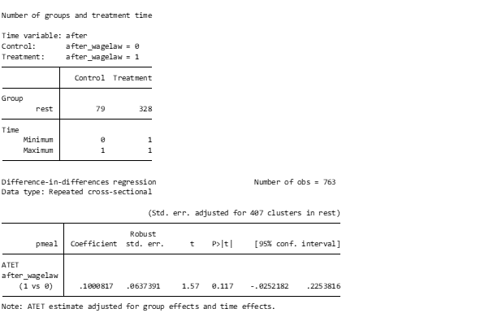
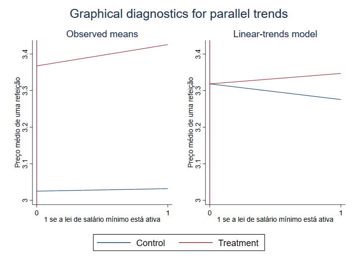

<!-- https://uclspp.github.io/PUBL0050/5-panel-data-and-difference-in-differences.html#seminar-4 -->
<!-- https://www.youtube.com/watch?v=BdXrFf2i2d4 -->

# Trabalho Acadêmico - Tópicos Avançados em Econometria

## Sobre

Em 1º de abril de 1992, o salário mínimo em Nova Jersey foi aumentado de US$ 4,25 para US$ 5,05. No estado vizinho da Pensilvânia, porém, o salário mínimo permaneceu constante em US$ 4,25. [David Card e Alan Krueger (1994)](doc/njmin-aer.pdf) analisaram o impacto do aumento do salário mínimo no emprego na indústria de fast-food, uma vez que este é um setor que emprega muitos trabalhadores com baixos salários.

Os autores coletaram dados sobre o número de funcionários de 331 restaurantes fast-food em Nova Jersey e 79 na Pensilvânia. O inquérito foi realizado em Fevereiro de 1992 (antes do aumento do salário mínimo) e em Novembro de 1992 (depois do aumento do salário mínimo).

## Variáveis e Transformações

Variáveis originais de interesse:

12. `nj` – variável dummy igual a 1 se o restaurante estiver localizado em Nova Jersey
13. `emptot` – o número total de pessoas empregadas no período pré-tratamento
14. `emptot2` – o número total de pessoas empregadas no período pós-tratamento
15. `wage_st` – variável que mede o salário inicial médio no restaurante no período pré-tratamento
16. `wage_st2` – variável que mede o salário médio inicial no restaurante no período pós-tratamento
17. `pmeal` – variável que mede o preço médio de uma refeição no período pré-tratamento
18. `pmeal2` – variável que mede o preço médio de uma refeição no período pós-tratamento
19. `co_owned` – variável dummy igual a 1 se o restaurante tivesse co-proprietário
20. `bk` – variável dummy igual a 1 se o restaurante fosse um Burger King
21. `kfc` – variável dummy igual a 1 se o restaurante fosse um KFC
22. `wendys` – variável dummy igual a 1 se o restaurante fosse um Wendys
23. `roys` - variável dummy igual a 1 se o restaurante fosse um Roys

Após transformação:

1. `rest` - identificador do restaurante
2. `wagelaw` - uma variável dummy igual a 1 se o restaurante estiver em um local com possibilidade de lei de salário mínimo
3. `after` - uma variável dummy igual a 1 se a lei de salário mínimo está em vigor
4. `branch` - qual a rede de restaurantes em questão (bk, kfc, roys, wendys)
5. `pmeal` - variável que mede o preço médio de uma refeição
6. `wage_st` - variável que mede o salário médio no restaurante
7. `emptot` - o número total de pessoas empregadas
8. `co_owned` - uma variável dummy igual a 1 se o restaurante tivesse co-proprietário

As variáveis foram transformadas para facilitar a análise. A rotina [transform.py](transform.py) concatenou as observações dos estados que implementaram e não implementaram a política de salário mínimo antes e depois desta entrar em vigor.

## Resultados

Ao passo que os dados trazem informações de alterações de políticas ao longo do tempo (similar a um tratamento médico com um grupo de controle), o modelo escolhido foi o _Difference in Difference_ (DiD).


Fonte: https://medium.com/bukalapak-data/difference-in-differences-8c925e691fff

Foram realizadas 3 análises sob óticas diferentes, onde a variável dependente alternou entre: nível médio de salários, número de empregados por restaurante e preço médio das refeições.

A primeira (ótica de salários) é útil para validar a fonte de dados, uma vez que, invariavelmente, a instauração da lei de salário mínimo aumentou os salários em Nova Jersey.

A segunda é interessante para determinar se uma política de salário mínimo pode trazer impacto sobre o número de trabalhadores por restaurante.

A terceira nos permite descobrir se os preços das refeições sofrem alteração com uma política de salário mínimo.

---

### Salários


Fonte: elaborada pelo autor.

Como $|t| \gt P $, aceita-se a hipótese que a lei de salário mínimo alterou os salários em Nova Jersey. O coeficiente positivo indica que a relação entre a política de salário minimo e remuneração é positiva, ou seja, a política eleva o salário.

> O que esta análise sugere sobre a eficácia da política de salário mínimo?

Os salários iniciais médios são claramente muito semelhantes em Nova Jersey e na Pensilvânia antes da mudança no salário mínimo de Nova Jersey. A diferença nas médias pré-tratamento é de cerca de 2 centavos:


Fonte: elaborada pelo autor.

Por outro lado, a diferença nas médias pós-tratamento é de quase 50 centavos. Isto sugere que o aumento do salário mínimo foi adotado com sucesso na maioria dos restaurantes de NJ:


Fonte: elaborada pelo autor.

---

### Número de Empregados

Como $|t| \gt P $, aceita-se a hipótese que a lei de salário mínimo alterou o número de empregados por restaurante em Nova Jersey.


Fonte: elaborada pelo autor.

A diferença nas médias antes do tratamento mostra que os restaurantes de Nova Jersey eram inicialmente significativamente menores em termos de funcionários em tempo integral empregados do que os restaurantes da Pensilvânia:


Fonte: elaborada pelo autor.

O cálculo do período pós-tratamento sugere que essa diferença nas taxas de emprego entre as lojas de NJ e PA havia desaparecido após a aplicação do tratamento:


Fonte: elaborada pelo autor.

Consequentemente, a diferença nas diferenças (ou seja, a diferença nas mudanças no emprego) é positiva e indica que as lojas de NJ tiveram um aumento relativo no emprego em comparação com as lojas PA.

É claro que a suposição crucial de identificação é que os restaurantes de NJ e PA teriam seguido tendências paralelas de emprego na ausência da mudança do salário mínimo. Esta suposição é muito difícil de avaliar com os dados que temos, uma vez que não há qualquer informação sobre os resultados do emprego em períodos anteriores.

---

### Preço das Refeições

> Os restaurantes que foram sujeitos a um aumento salarial aumentam os preços do fast-food?

A estimativa da diferença em diferenças sugere que existe um aumento muito pequeno (cerca de 8 centavos) no preço médio de uma refeição após a introdução do novo salário mínimo em NJ. Não parece que os custos do aumento do salário mínimo tenham sido repercutidos nos consumidores.


Fonte: elaborada pelo autor.

Para essa análise, também foi possível montar o gráfico de tendências paralelas para o modelo:


Fonte: elaborada pelo autor.

---

### Conclusão

TODO: elaborar conclusão. Olhar para as análises acima e mencionar que seria interessante explorar futuramente discrepâncias entre as redes (Burger King seguiu a política igual ao Wendys?).

---

## Execução

`transform.py` transforma a base original para facilitar a análise em softwares estatísticos. Para utilizar:

```sh
python3 -m venv venv
source venv/bin/activate
python3 -m pip install -r requirements.txt
python3 transform.py > csv/output.csv
```

Com a base de dados pronta para análise, basta executar a rotina `analysis.do` no Stata. A versão testada foi `Stata 17 MP`.
